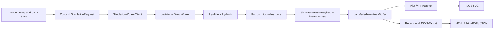

# Microtube Design Explorer — Begleitanwendung zum Paper

> **Zweck dieser Seite:** Selbstständige technische und wissenschaftliche
> Übersicht der Webanwendung für das Repository des begleitenden Papers.
> **Stand:** Anwendung und Scientific Core 0.1.0, 2026-07-13.
> **Paper:** *Local Resistance-Based Design-Space Analysis of Polyamide
> Microtubes for Compact Heat Exchangers*.
> **Kanonisches Software-Repository:**
> <https://github.com/pdoeble/MicrotubeDesignExplorer>
> **Bereitgestellte Anwendung:**
> <https://pdoeble.github.io/MicrotubeDesignExplorer/>

## 1. Kurzfassung

Der **Microtube Design Explorer** ist die vollständig statische,
reproduzierbare Begleitanwendung zum Paper. Er überführt das freigegebene
MATLAB-Screeningmodell `Waermedurchgang_V10_physical.m` in einen reinen,
typisierten Python-Kern und führt diesen direkt im Browser aus. Die Anwendung
benötigt keinen Produktionsserver, keine Datenbank, keine Sitzung auf einem
Backend und keine Zugangsdaten.

Die App vergleicht zwei Wärmeübertragerkonfigurationen – im Paper-Standardfall
Aluminium als Referenz und Polyamid (PA) als Vergleich – über einen
zweidimensionalen Entwurfsraum aus Rohraußendurchmesser `d_o` und Wanddicke
`t`. Sie berechnet thermische Leistung, Strömungszustände, Druckverlust,
mechanische Integrität, Fertigungsgrenzen, Kostenindex und kombinierte
Machbarkeit. Ergebnisse werden als wissenschaftliche Design-Space-Karten,
Kennwerttabellen sowie reproduzierbare JSON-, HTML-, PDF-, PNG- und
SVG-Ausgaben bereitgestellt.

Die wissenschaftliche Rechnung findet in Python/NumPy statt. React und
TypeScript übernehmen ausschließlich Eingabe, Zustandsverwaltung,
Browserkommunikation, Darstellung und Export. Sämtliche numerisch schweren
Arbeiten laufen in einem dedizierten Web Worker mit Pyodide und blockieren
nicht den UI-Thread.

### Was die Anwendung besonders macht

- vollständige lokale Browserrechnung statt eines vereinfachten
  Visualisierungs-Frontends;
- direkter Python-Port der freigegebenen MATLAB-Physik;
- interne SI-Einheiten und explizite Umrechnung nur an Anzeigegrenzen;
- versionierte Pydantic-/JSON-Schema-/TypeScript-Verträge;
- numerische Regression gegen unveränderliche MATLAB-Golden-Daten;
- vollständige Herkunftsinformationen mit Request-Hash und Versionsständen;
- papergetreue, SVG-kompatible Plotly-Abbildungen;
- verpflichtende statische Bereitstellung über GitHub Pages und vorbereitete
  Portabilität für eine spätere parallele, zugriffsgeschützte GitLab Page, ohne
  Übertragung der wissenschaftlichen Eingaben an einen Rechenserver.

## 2. Rolle gegenüber dem Paper

Die Anwendung ist kein getrenntes physikalisches Modell. Sie ist eine
interaktive Ausführungs- und Analyseoberfläche für dasselbe
Widerstands-/Screeningmodell, das dem Paper zugrunde liegt. Ihr Zweck ist:

1. den im Paper verwendeten Referenzfall reproduzierbar auszuführen;
2. Annahmen, Gültigkeitsgrenzen und Screening-Entscheidungen sichtbar zu
   machen;
3. die lokale Umgebung eines Designpunkts im vollständigen Entwurfsraum zu
   untersuchen;
4. Aluminium- und PA-Konfigurationen bei gleicher oder angepasster Geometrie
   zu vergleichen;
5. Paper-Abbildungen und ergänzende Diagnosekarten reproduzierbar zu
   exportieren;
6. einen maschinenlesbaren Ergebnisnachweis neben dem visuellen Bericht zu
   erzeugen.

Die App ist **keine** CFD-Simulation, kein Optimierer, kein Ersatz für
Bauteilversuche und kein Zertifizierungswerkzeug. Ein als machbar markierter
Punkt erfüllt nur die im Request aktivierten Modell- und Screeningbedingungen.

## 3. Quellenhierarchie und wissenschaftliche Governance

Konflikte werden nicht stillschweigend aufgelöst. Für Modell, Werte und
Darstellung gilt folgende Reihenfolge:

1. akzeptierte Gleichungen, Annahmen und Werte im aktuellen
   [`Paper.pdf`](../source_materials/Paper.pdf);
2. das ausführbare Legacy-Modell
   [`Waermedurchgang_V10_physical.m`](../source_materials/Waermedurchgang_V10_physical.m);
3. die übrigen schreibgeschützten Paper-, LaTeX-, MATLAB- und Exportquellen
   unter `source_materials/`;
4. dauerhaft dokumentierte Entscheidungen und Modellnotizen im
   [`wiki/`](index.md);
5. Living Plans unter [`plans/`](../plans/);
6. Kommentare und Issue-Texte.

Entscheidungen mit fachlicher oder architektonischer Wirkung werden als ADR
unter [`wiki/decisions/`](decisions/index.md) festgehalten. Für die aktuelle
Plotdarstellung sind besonders relevant:

- [ADR-0007](decisions/ADR-0007-plot-display-fidelity-policy.md):
  Display-Transformation und Paper-Geometrie;
- [ADR-0011](decisions/ADR-0011-scientific-plot-audit-and-navigation.md):
  Isolinien, Comparison-Grenzen, kontinuierliche Designgrenzen, lokale
  45°-Schraffuren und wissenschaftliche Plotnavigation.

Ein Beispiel für eine explizite Konfliktauflösung ist die luftseitige
Reynolds-Zahl: Das alte MATLAB-Skript exportiert zusätzlich eine einfache
`v_a d_o/ν`-Diagnose. Das aktuelle Paper beschreibt den luftseitigen
Wärmeübergang jedoch konsistent mit der VDI-G7-Definition. Deshalb zeigt die
öffentliche App nur die VDI-G7-Reynolds-Karte; das alte Feld bleibt lediglich
aus Kompatibilitätsgründen im Ergebnisvertrag erhalten.

## 4. Wissenschaftlicher Umfang

### 4.1 Entwurfsraum

Die nativen Sweep-Variablen sind:

- Rohraußendurchmesser `d_o`;
- nominale Wanddicke `t`.

Die Standardachsen sind logarithmisch verteilt. `d_o` liegt zwischen
0,1 und 10 mm, `t` zwischen 0,001 und 4,5 mm. Die Standardauflösung beträgt
250 × 250 Punkte. Berechnet wird bis zu einem Wanddickenverhältnis
`τ = 100 t/d_o` von 45 %, während die wissenschaftlichen Karten den Bereich
0–40 % darstellen. Arrays besitzen die Form
`(n_wall_thickness, n_outer_diameter)`: Zeilen sind Wanddicken, Spalten sind
Außendurchmesser.

Ungültige Geometrie wird markiert, bevor Logarithmen, Divisionen oder
Korrelationen ausgewertet werden. Nicht endliche oder unzulässige Werte
werden nicht verdeckt geklemmt oder extrapoliert.

### 4.2 Wärmeübergang

Der thermische Kern ist widerstandsbasiert:

- **außen:** VDI-Wärmeatlas, 12. Auflage (2019), Kapitel G7, quer
  angeströmtes Inline-Rohrbündel;
- **innen:** VDI-Wärmeatlas, 12. Auflage (2019), Kapitel G1, Kreisrohrströmung;
- **Wand:** zylindrische Wärmeleitung;
- **Aggregation:** Summe der auf die Außenfläche bezogenen Widerstände.

Die wichtigsten Beziehungen sind:

- `d_i = d_o - 2t`;
- `R_i = d_o/(d_i α_i)`;
- `R_w = d_o ln(d_o/d_i)/(2 λ_wall)`;
- `R_o = 1/α_o`;
- `k_o = 1/(R_i + R_w + R_o)`;
- `k_o A_o` als Gesamtleitwert des Bündels.

Die VDI-G1-Implementierung unterscheidet laminare Strömung, den
Übergangsbereich von `Re = 2300` bis `Re = 10000` und turbulente Strömung.
Die Übergangsanker entsprechen dem MATLAB-Referenzmodell und sind nicht durch
eine frei gewählte Glättung ersetzt. G1 unterstützt konstante Wandtemperatur
und konstanten Wärmestrom sowie die optionale Prandtl-Wandkorrektur.

VDI G7 verwendet die charakteristische Länge `π d_o/2`, den
Hohlraum-/Void-Faktor des Inline-Bündels und wahlweise die im Modell
vorgesehene Korrektur für endliche Rohrreihen. Der Paper-Standard verwendet
den asymptotischen Viele-Reihen-Fall.

Ausführliche Gleichungen und Quellen stehen in
[model/equations.md](model/equations.md).

### 4.3 Geometrie und Bündel

Der Kern berechnet unter anderem:

- Innen- und Außendurchmesser sowie Wanddickenverhältnis;
- kontinuierliche Rohrzahl im vorgegebenen Bauraum;
- diskrete Rohrzahlen für kostenrelevante Operationen;
- Außenfläche des Rohrbündels;
- Quer- und Längsteilung;
- freie Abstände für Inline- und Staggered-Diagnosen.

Der öffentlich freigegebene G7-Wärmeübergang ist in Vertragsversion 1.0.0 auf
die Inline-Anordnung beschränkt. Staggered-Abstände werden als geometrische
Diagnose berechnet, bilden aber kein zweites freigegebenes G7-Wärmeübergangs-
modell.

### 4.4 Hydraulik und Betriebsarten

Der innere Druckverlust ist ein gerades Rohrmodell nach Darcy–Weisbach mit
glattem Rohr. Der Reibungsbeiwert ist `64/Re` im laminaren Bereich, verwendet
den freigegebenen turbulenten Ausdruck oberhalb `Re = 10000` und eine
deterministische lineare Überblendung der Endwerte im Übergangsbereich.

Unterstützte luftseitige Betriebsarten:

- konstante Geschwindigkeit;
- konstanter Volumenstrom;
- konstanter Massenstrom.

Unterstützte kühlmittelseitige Betriebsarten:

- konstante Geschwindigkeit;
- konstanter Volumenstrom;
- konstanter Massenstrom;
- vorgegebener Rohrdruckverlust;
- vorgegebene hydraulische Leistung.

Die beiden letzten Modi invertieren die monotone Rohrgleichung mit einer
deterministischen Bisektion. Nicht lösbare Zellen erzeugen NaN, Maske und
Warnung statt eines stillen Ersatzwerts. Luftseitige Druckverlust- oder
Leistungsmodi sind nicht implementiert, weil dafür keine freigegebene
Modellbasis vorliegt.

### 4.5 Mechanische Integrität

Der Berstdruck folgt der Lamé-Beziehung mit einer toleranzbereinigten lokalen
Mindestwand. Wenn `t_nominal - tolerance <= 0` gilt, ist die Geometrie für
diese Rechnung ungültig. Neben der konfigurierten Toleranz werden die
Paper-Sensitivitäten 0,020 mm (Standard) und 0,005 mm (Medical) exportiert.

Das Modell ersetzt keine Werkstofffreigabe, Ermüdungsrechnung,
Verbindungsbewertung oder Sicherheitszertifizierung.

### 4.6 Kapillarität und Kostenindex

Die Kapillarhöhe wird als `h = C_cap/(s G)` aus materialspezifischer
Kapillarkonstante, freiem Abstand und Beschleunigungsfaktor berechnet. Neben
der konfigurierten Screen-Beschleunigung werden 1g, 5g und 10g als
Sensitivitätskarten ausgegeben.

Der Kostenwert ist ein relativer Rohrbeschaffungsindex aus effektiver
Rohmateriallänge und materialspezifischem Referenzfaktor. Er ist **kein**
Marktpreis, keine Lieferantenprognose und kein empirischer Fit.

### 4.7 Design-Screens

Eine Zelle ist in der kombinierten Designkarte nur zulässig, wenn alle
aktiven Bedingungen erfüllt sind:

1. endliche positive Leitfähigkeit `k_o A_o`;
2. Material-Mindestwand eingehalten;
3. toleranzbereinigter Berstdruck mindestens am Grenzwert;
4. Kühlmittelvolumenstrom mindestens am Grenzwert;
5. Rohrdruckverlust höchstens am Grenzwert;
6. Kostenindex strikt kleiner als der Grenzwert;
7. Kapillarhöhe höchstens am Grenzwert.

Die Anwendung unterscheidet explizit zwischen ungültiger Geometrie,
außerhalb der Korrelation gültiger Rechnung, durch Screens verworfenem Design
und lediglich nicht optimalem Design.

## 5. Paper-Standardfall

Alle Defaults stammen aus einer einzigen versionierten Quelle,
[`microtubes_core.defaults`](../python/microtubes_core/defaults.py), und werden
gegen den MATLAB-Snapshot geprüft.

| Größe | Referenzwert |
| --- | ---: |
| Referenzdesign | Aluminium |
| Vergleichsdesign | Polyamid (PA) |
| Bündelbreite | 98,4 mm |
| Bündeltiefe in Luftströmungsrichtung | 72,0 mm |
| aktive Rohrlänge | 160 mm |
| Quer-/Längsteilungsverhältnis | 3,28 / 2,00 |
| Anordnung | inline |
| Luftzustand | 20 °C, 1 bar |
| Luftgeschwindigkeit | 5,0 m/s |
| Kühlmittel | EGL 50:50 bei 70 °C |
| mittlere Kühlmittelgeschwindigkeit | 0,5 m/s |
| validierter Designpunkt | `d_o = 1,0 mm`, `t = 0,1 mm`, `τ = 10 %` |
| Sweep | 250 × 250, `d_o = 0,1…10 mm` |

Die Geometrie, Luftseite, Kühlmittelseite und Randbedingungen sind standard-
mäßig zwischen Referenz und Vergleich verknüpft; die Materialien sind getrennt.

### Materialdefaults

| Eigenschaft | Aluminium | Polyamid (PA) |
| --- | ---: | ---: |
| Wärmeleitfähigkeit | 220 W/(m K) | 0,25 W/(m K) |
| Zugfestigkeit im Modell | 200 MPa | 10 MPa |
| technologische Mindestwand | 0,070 mm | 0,025 mm |
| Kapillarkonstante | 6,2856 mm² | 5,4 mm² |
| Kosten-Referenzindex | 2,09623 | 0,626902 |

### Standard-Screens

| Bedingung | Grenzwert |
| --- | ---: |
| Mindestberstdruck | 6 bar |
| Mindest-Kühlmittelvolumenstrom | 10 L/min |
| maximaler Rohrdruckverlust | 0,5 bar |
| maximaler Kostenindex | 5,0 (streng unterschritten) |
| maximale Kapillarhöhe | 2 mm |
| Kapillar-Beschleunigung | 10g |
| Wandtoleranz | 0,020 mm |

## 6. Softwarearchitektur

### 6.1 Feste Architekturentscheidung

- **Deployment:** statische GitHub Pages bleiben verpflichtend und produktiv;
  eine statische GitLab Page darf nach externer Freischaltung parallel laufen;
- **Frontend:** React, TypeScript und Vite;
- **Zustand:** Zustand Store plus versionierter URL-State;
- **Scientific Core:** reines Python-Paket `microtubes_core`;
- **Browser-Python:** Pyodide in einem dedizierten Module Web Worker;
- **Numerik:** NumPy `float64`;
- **Verträge:** Pydantic v2, JSON Schema und generierte TypeScript-Typen;
- **Plots:** Plotly.js über typisierte Adapter, ohne WebGL-Traces;
- **Paketmanager:** `pnpm` und `uv`, jeweils mit Lockfile.

### 6.2 Datenfluss



Der Hauptthread importiert Pyodide nicht. Er sendet ausschließlich
versionierte Worker-Nachrichten. Numerische Arrays werden C-kontiguierlich als
`float64` erzeugt, in dedizierte `ArrayBuffer` kopiert und ohne JSON-
Zahlenlisten transferiert.

### 6.3 Scientific Core

Der Python-Kern ist deterministisch, ohne UI-Abhängigkeit und in fachliche
Module getrennt:

| Bereich | Pfad |
| --- | --- |
| Öffentliche API und Ergebnisregistrierung | `python/microtubes_core/api.py` |
| Pydantic-Verträge | `python/microtubes_core/contracts.py` |
| versionierte Defaults | `python/microtubes_core/defaults.py` |
| Geometrie | `models/geometry.py` |
| VDI-Korrelationen | `models/correlations.py` |
| Betriebsarten/Inversion | `models/operating.py` |
| Druck und Bersten | `models/pressure.py` |
| Widerstände | `models/resistances.py` |
| Kapillarität und Kosten | `models/capillary.py`, `models/cost.py` |
| Sweep und Masken | `sweeps/design_space.py`, `sweeps/screens.py` |
| Materialvergleich | `sweeps/comparison.py` |
| kanonischer Report | `exports/report.py` |

Die öffentliche Python-Schnittstelle lautet:

```text
SimulationRequest -> simulate(...) -> SimulationResult
SimulationResult = JSON-Metadaten + Tupel referenzierter float64-Arrays
```

### 6.4 Browserlaufzeit und statische Assets

`scripts/prepare_pyodide_assets.mjs` stellt beim Build bereit:

- Pyodide-Laufzeit und Python-Standardbibliothek;
- NumPy, Pydantic und transitive Pyodide-Abhängigkeiten;
- das lokal mit `uv build` gebaute `microtubes_core`-Wheel;
- SHA-256-Manifeste für Laufzeitpakete und Core-Wheel.

Fehlende Pyodide-Pakete werden nur während der Buildvorbereitung aus dem
versionierten Pyodide-CDN geladen und gegen den Lockfile-Hash geprüft. Die
ausgelieferte Anwendung lädt zur Laufzeit alle Python-Artefakte vom selben
jeweiligen Pages-Ursprung. Es gibt keinen externen Rechen-API-Aufruf.

### 6.5 Workerprotokoll, Fortschritt und Abbruch

Das Workerprotokoll 1.0.0 kennt `init`, `compute` und `cancel` sowie die
Antworten `ready`, `progress`, `result`, `cancelled` und `error`.
Fortschrittsphasen umfassen das Laden von Pyodide, Paketen und Core sowie
Rechnung und Serialisierung.

Der Worker ist innerhalb von Pyodide single-threaded. Ein Abbruch unterdrückt
die Zustellung eines überholten Resultats an definierten Übergabepunkten; er
unterbricht nicht beliebig eine bereits laufende Python-Instruktion. Neue
Requests supersedieren ältere. Der Client kann Ergebnisse über einen stabilen
Hash validierter Inputs wiederverwenden.

## 7. Öffentliche Verträge und Versionierung

### 7.1 Versionsmatrix

| Gegenstand | Aktuelle Version | Quelle |
| --- | --- | --- |
| Anwendung | 0.1.0 | `package.json` |
| Python Core | 0.1.0 | `python/microtubes_core/__init__.py` |
| SimulationRequest/Result | 1.0.0 | Pydantic-Vertrag |
| Paper-Defaults | 1.0.0 | `microtubes_core.defaults` |
| Workerprotokoll | 1.0.0 | `src/workers/protocol.ts` |
| URL-State | 2.0.0 (Reader weiterhin 1.0.0) | `src/state/urlState.ts` |
| Reportpayload | 1.0.0 | Python- und TypeScript-Exportadapter |
| Pyodide | 314.0.2 | `package.json`/Assetmanifest |

Vertragsversionen folgen Semantic Versioning. Additive benannte Ergebnisfelder
sind in Vertrag 1.0.0 erlaubt. Breaking Changes benötigen vor der
Implementierung einen ADR und eine koordinierte Migration von Python,
JSON-Schema, TypeScript, Worker, URL-State, Tests und Dokumentation.

### 7.2 SimulationRequest

Der Request enthält:

- gemeinsamen Sweep;
- Referenz- und Vergleichskonfiguration;
- Geometrie, Material, Luft- und Kühlmittelseite;
- thermische Randbedingung, Toleranz und Screens;
- markierten Designpunkt;
- Link-Flags für fünf Eingabekategorien;
- verpflichtende Vertragsversion.

Alle Werte sind intern SI. Die Eingabeoberfläche liest Anzeigeeinheit,
Faktor, Bereich, Schritt und Skalierung aus einem versionierten
Parametermanifest. Verknüpfte Kategorien müssen zwischen beiden Designs
inhaltlich identisch sein; Pydantic erzwingt diese Invariante.

### 7.3 SimulationResult

Der JSON-Teil enthält Achsen, Feldreferenzen, Maskenreferenzen,
Kennwertzusammenfassungen, Screenstatus, Warnungen, Fehler und Provenienz.
`GridFieldRef` verknüpft Name, Einheit, Form und `buffer_index` mit einem
transferierten Array. Verbraucher lösen Felder nach Namen auf und dürfen sich
nicht auf eine feste Arrayreihenfolge verlassen.

Die wichtigsten Warnklassen sind:

- außerhalb der Korrelation gültig, aber numerisch auswertbar;
- durch Screens verworfen;
- diskreter Geometrieübergang;
- physikalisch ungewöhnlicher Wert;
- kein zulässiger Vergleichsreferenzpunkt.

Fehler- und Warnobjekte bewahren den fachlichen Kontext und enthalten nach
Möglichkeit Auswirkung, betroffene Größe und Handlungsempfehlung.

Vertragsdetails stehen in
[interfaces/contracts.md](interfaces/contracts.md), das Transportprotokoll in
[interfaces/worker-protocol.md](interfaces/worker-protocol.md).

## 8. Bedienkonzept

### 8.1 Hauptbereiche

Die Anwendung hat vier Haupttabs:

1. **Start** – Zweck, Kurzanleitung, Modellgrundlage, Version und Zitation;
2. **Model Setup** – wissenschaftliche Eingaben;
3. **Results** – Rechnung, Plotwahl, Kennwerte und Exporte;
4. **Settings** – Rücksetzen, öffentliche Softwareidentität, Autorenschaft,
   Lizenz, Zitation und Repository. URL-State-Diagnostik, interne
   Validierungsquellen und Verknüpfungsstatus werden dort nicht angezeigt.

Die frühere Route `#/materials` wird kompatibel auf `#/input` normalisiert.

### 8.2 Model Setup

Referenz und Vergleich erhalten frei wählbare Namen. Die Eingaben sind nach
fachlichem Inhalt gegliedert:

- Geometry;
- Solid material;
- Air circuit;
- Coolant circuit;
- Screens & boundaries.

Für jede Kategorie kann zwischen Referenz und Vergleich umgeschaltet und
festgelegt werden, ob beide dieselben oder getrennte Werte verwenden. Beim
Verknüpfen wird der Referenzwert übernommen; ein zuvor unabhängiger
Vergleichswert wird intern gesichert und beim erneuten Trennen wiederhergestellt.

Geometrie kann direkt als Breite/Tiefe/Rohrlänge oder äquivalent als Volumen
und Seitenverhältnisse eingegeben werden. Die Umrechnung ist exakt und wird
auf API-Ebene getestet. Numerische Controls kombinieren beschriftete Eingabe,
Slider, Anzeigeeinheit, Einzel-Reset und Validierungstext.

### 8.3 URL-State

Jede wissenschaftliche Konfigurationsänderung wird als versioniertes,
verlustfrei komprimiertes und Base64URL-kodiertes JSON im Queryparameter
`state` gespeichert. Version 2 verwendet das Präfix `v2.` und Zlib/DEFLATE;
unpräfixierte Links der Version 1 bleiben lesbar. Damit ist eine Konfiguration
durch Kopieren der URL teilbar und reproduzierbar, ohne GitLabs
2.048-Zeichen-Standardlimit bereits beim Paper-Default zu überschreiten. Der
Zustand enthält den vollständigen `SimulationRequest`, nicht die
Ergebnisarrays. Transiente Plotauswahl und Workerzustände bleiben lokal.

Unbekannte oder beschädigte URL-State-Versionen werden verworfen; die App
fällt auf die Paper-Defaults zurück. **Reset to paper defaults** stellt die
versionierte Standardkonfiguration wieder her.

### 8.4 Results

**Run simulation** initialisiert bei Bedarf den Worker und berechnet den
aktuellen Request. Die Oberfläche zeigt Fortschritt, Fehler und anschließend:

- den gewählten Einzel-, Tandem-, Vergleichs- oder Composite-Plot;
- eine Kennwerttabelle am markierten Designpunkt;
- Screenstatus und Warnungen;
- Plotdatenzusammenfassung und zugängliche Beschreibung;
- Einzelbild- und Reportexporte.

Die KPI-Tabelle umfasst mindestens Gesamtwärmeübergangskoeffizient,
Bündelleitwert, Rohrdruckverlust, Kühlmittelvolumenstrom, Berstdruck,
Kapillarhöhe und Kostenindex für beide Designs.

## 9. Plotkatalog und wissenschaftliche Darstellung

Die öffentliche Registry enthält 40 stabile Plot-IDs in sieben fachlichen
Gruppen. Die interne Plotart ist Adaptermetadata und bestimmt nicht die
Benutzernavigation.

### 9.1 Thermal performance

| Plot-ID | Aussage |
| --- | --- |
| `overall-coefficient-map` | Gesamtwärmeübergangskoeffizient `k_o` |
| `bundle-conductance-map` | Bündelleitwert `k_o A_o` |
| `inner-heat-transfer-map` | VDI-G1-Innenkoeffizient `α_i` |
| `graetz-tube-side-map` | lokale Graetz-Zahl `Gz_i` |
| `g1-diameter-sensitivity-map` | lokale G1-Durchmessersensitivität bei festem `v_i` |
| `outer-heat-transfer-map` | VDI-G7-Außenkoeffizient `α_o` |

### 9.2 Thermal resistance attribution

| Plot-ID | Aussage |
| --- | --- |
| `resistance-shares-grid` | Anteile von Innen-, Wand- und Außenwiderstand für beide Designs |
| `wall-biot-map` | effektive Wand-Biot-Zahl `k_o d_o/λ_w` |
| `resistance-inner-map` | absoluter Innenwiderstand |
| `resistance-wall-map` | absoluter Wandwiderstand |
| `resistance-outer-map` | absoluter Außenwiderstand |

### 9.3 Geometry and tube packing

| Plot-ID | Aussage |
| --- | --- |
| `tube-count-map` | kontinuierliche Rohrzahl im Bauraum |
| `bundle-area-map` | Rohrbündel-Außenfläche |
| `tube-spacing-longitudinal-map` | freier Längsabstand |
| `tube-spacing-transverse-map` | freier Querabstand |
| `tube-spacing-closest-inline-map` | kleinster Inline-Abstand |
| `tube-spacing-closest-staggered-map` | kleinster geometrischer Staggered-Abstand |

### 9.4 Flow regimes and hydraulics

| Plot-ID | Aussage |
| --- | --- |
| `coolant-throughput-map` | gesamter Kühlmittelvolumenstrom |
| `coolant-mass-flow-map` | gesamter Kühlmittelmassenstrom |
| `friction-pressure-drop-map` | gerader Rohrdruckverlust |
| `hydraulic-power-map` | hydraulische Leistung `Δp · Vdot` |
| `reynolds-tube-side-map` | innere Reynolds-Zahl und Übergang |
| `reynolds-air-vdi-map` | Paper-konforme VDI-G7-Reynolds-Zahl |

### 9.5 Mechanical integrity

| Plot-ID | Aussage |
| --- | --- |
| `burst-tolerance-grid` | Standard-/Medical-Toleranz für beide Materialien |
| `burst-pressure-map` | Berstdruck mit Standardtoleranz |
| `burst-pressure-medical-map` | Berstdruck mit Medical-Toleranz |

### 9.6 Manufacturing limits and cost

| Plot-ID | Aussage |
| --- | --- |
| `capillary-rise-grid` | 1g/5g/10g × beide Materialien |
| `capillary-rise-map` | Kapillarhöhe bei konfigurierter Beschleunigung |
| `capillary-rise-1g-map` | Sensitivität bei 1g |
| `capillary-rise-5g-map` | Sensitivität bei 5g |
| `capillary-rise-10g-map` | Sensitivität bei 10g |
| `tube-supply-cost-map` | relativer Rohrbeschaffungsindex |

### 9.7 Feasibility and material comparison

| Plot-ID | Aussage |
| --- | --- |
| `design-boundary-lines` | Leitwert, einzelne Screen-Grenzen und kombinierte Machbarkeit |
| `feasibility-mask-map` | kategorische All-Screen-Machbarkeit |
| `tech-adjusted-delta-k` | prozentuale `k_o`-Differenz gegen nächste zulässige Referenz |
| `tech-adjusted-ratio-k` | entsprechendes `k_o`-Verhältnis |
| `tech-adjusted-delta-ka` | prozentuale Leitwertdifferenz gegen zulässige Referenz |
| `tech-adjusted-ratio-ka` | entsprechendes Leitwertverhältnis |
| `same-geometry-ratio` | prozentuale `k_o`-Differenz bei gleicher Geometrie |
| `same-geometry-ratio-value` | `k_o`-Verhältnis bei gleicher Geometrie |

Der vollständige bindende Katalog steht in
[model/plot-catalog.md](model/plot-catalog.md).

### 9.8 Vergleichslogik

Der Same-Geometry-Vergleich verwendet denselben `(d_o, t)`-Punkt für beide
Designs und maskiert Bereiche unterhalb der größeren Material-Mindestwand.

Der technologieangepasste Vergleich sucht für jede zulässige
Vergleichszelle einen zulässigen Referenzpunkt bei gleichem
Wanddickenverhältnis und gleichem oder größerem Durchmesser. Der erste Punkt,
der alle Screens erfüllt, liefert Referenz-`k_o`, Referenz-`k_o A_o` und
Referenzdurchmesser. Deltas folgen der Paperkonvention
`100 · (ratio - 1)`.

Die dichte zusammengesetzte Machbarkeitsgrenze wird im Core berechnet. Der
Darstellungsadapter schließt nur den Subzellenabstand zwischen dieser Kurve
und dem ersten endlichen nativen Vergleichswert und schneidet den Rasterrand
visuell exakt an der exportierten Kurve. Wissenschaftliche Ergebnisarrays
werden dabei nicht verändert.

### 9.9 Darstellungsregeln

- interne Werte und Stil sind getrennt;
- Achsen zeigen `d_o` logarithmisch und `τ` linear;
- die Display-Transformation von `(d_o,t)` nach `(d_o,τ)` interpoliert nur
  zwischen benachbarten endlichen Punkten und niemals über NaN-Grenzen;
- Binärmasken und Statuswerte verwenden nearest-neighbour Placement;
- alle kontinuierlichen Karten besitzen Isolinien;
- die kategorische Machbarkeitsmaske ist die einzige Isolinien-Ausnahme;
- Isolinienlabels folgen der lokalen Tangente, bleiben zwischen −90° und +90°
  aufrecht, sind von der Linie freigestellt und vermeiden andere Labels,
  Achsen, Marker und Rohrskizzen;
- dichte Felder behalten alle Konturlinien, beschriften aber nur eine lesbare
  Auswahl;
- Colorbar-Ticks werden aus physischer Balkenlänge und Textausdehnung gewählt;
- Farben sind farbenblind- und drucktauglich; Machbarkeit wird nie nur durch
  Farbe vermittelt;
- die Spektralskala ist eine exakte 256-Farben-Abbildung von
  MATLAB `slanCM('spectral')`, kein visueller Fit;
- Rohrquerschnitte, Marker, Linienbreiten, Fonts und Ränder skalieren aus
  Paper-Abmessungen in Zentimetern;
- Design-Screen-Linien werden aus kontinuierlichen Ergebnisfeldern am aktiven
  Grenzwert gewonnen;
- jede Schraffur beginnt exakt auf ihrer lokalen Grenzlinie und zeigt unter
  lokal 45° in den verworfenen Bereich;
- Abbildungen tragen einen Provenienzfooter.

## 10. Export und Bericht

### 10.1 Einzelabbildungen

Jeder Plot bietet:

- PNG mit wählbarem Skalierungsfaktor;
- SVG für verlustfreie Paper-/Vektornutzung.

Der Export erzeugt eine frische Plot-Spezifikation in der referenzierten
Paper-Geometrie statt einen beliebig skalierten Screenshot des aktuellen
DOM-Containers. Titelkontext, Achsen, Einheiten, Legende, Marker und Provenienz
bleiben enthalten.

### 10.2 JSON-Sidecar

Das kanonische JSON enthält:

- Reportversion und Request-Hash;
- vollständigen validierten Request;
- öffentliches Ergebnis-Payload;
- Kennwertzusammenfassungen und Warnungen;
- Arraymanifest mit Quelle, Feldname, Einheit, Form, SHA-256,
  Finite-/NaN-Anzahl, Minimum und Maximum.

Die Arrays selbst werden nicht als riesige JSON-Listen dupliziert. Die
kanonische Serialisierung sortiert Schlüssel, verbietet NaN in JSON und ist
für dieselbe Request-/Result-Kombination byte-deterministisch.

### 10.3 HTML und PDF

Der Standalone-HTML-Report enthält Eingaben, Annahmen, Warnungen,
Screenstatus, Kennwerte, ausgewählte SVG-Abbildungen, Arraymanifest,
Provenienz und eingebettetes kanonisches Sidecar-JSON. Die feste
Abbildungsauswahl umfasst die wichtigsten thermischen, mechanischen,
fertigungstechnischen und Vergleichsdarstellungen.

**Print / PDF** öffnet denselben Report in einer druckoptimierten
Browseransicht. Die PDF-Erzeugung erfolgt über den lokalen Browserdruck und
benötigt keinen Server. Wo SVG zuverlässig unterstützt wird, bleiben die
Abbildungen als SVG im HTML; die konkrete PDF-Vektorerhaltung hängt vom
verwendeten Browser-/Drucktreiber ab.

Details: [interfaces/report-payload.md](interfaces/report-payload.md).

## 11. Reproduzierbarkeit, Herkunft und Datenschutz

### 11.1 Request- und Ergebnisidentität

Der Python-Kern berechnet SHA-256 über die kanonische JSON-Darstellung des
validierten Requests. Das Ergebnis enthält:

- Coreversion;
- Vertragsversion;
- vollständigen Request-Hash;
- UTC-Erzeugungszeit;
- Referenz auf die Golden-Provenienz.

Frontend-Cache und URL-State ersetzen diesen wissenschaftlichen Hash nicht.
Der Provenienzfooter kürzt den Hash nur für die Darstellung; im Payload bleibt
er vollständig.

### 11.2 Golden-Daten

`reference/` enthält unveränderliche MATLAB-R2024b-Referenzen mit Manifest,
Dateihashes, Skripthash, Datentyp, Form und Speicherordnung. Abgedeckt sind
unter anderem:

- vollständige 250×250-Standardfelder und Masken;
- skalare Defaults und Modellkonstanten;
- G1-/G7-Zweigfälle und Übergangsanker;
- Reibung, Berstdruck, Kosten und Kapillarität;
- ungültige Geometrie;
- Same-Geometry- und technologieangepasste Vergleiche.

Standardtoleranzen für numerische Vergleiche sind `rtol=1e-8` und
`atol=1e-10`, sofern keine Größe ausdrücklich anders begründet ist. Golden-
Dateien dürfen niemals geändert werden, nur um einen Test grün zu machen.
Regeneration benötigt MATLAB R2024b, neue Provenienz und fachliche Prüfung.

Siehe [model/golden-data.md](model/golden-data.md) und
[model/scientific-validation.md](model/scientific-validation.md).

### 11.3 Lokale Datenverarbeitung

Wissenschaftliche Eingaben und Ergebnisse werden im Browser verarbeitet. Die
Anwendung enthält keine Telemetrie, kein Produktionsbackend und keine
serverseitige Persistenz. Beim normalen Lauf werden Requests nicht an GitHub
oder eine andere Rechen-API gesendet. Dateien werden lokal erzeugt und über
den Browser heruntergeladen bzw. gedruckt.

Die teilbare URL enthält den vollständigen wissenschaftlichen Request in
kodierter, aber **nicht verschlüsselter** Form. Wer eine solche URL erhält,
kann die darin enthaltene Konfiguration lesen. Vertrauliche Eingaben gehören
nicht in einen geteilten Link.

## 12. Validierung und Qualitätssicherung

### 12.1 Python

- `pytest`: Funktionen, Verträge, Sweeps, Vergleiche, Reports und Golden-
  Parität;
- `ruff check` und `ruff format --check`;
- `mypy` im Strict-Modus;
- NumPy-`float64` und typisierte öffentliche APIs.

### 12.2 Frontend und Verträge

- Vitest und Testing Library für State, Controls, Verträge, Workerclient,
  Plot-Spezifikationen und Reportadapter;
- Ajv gegen die generierten JSON-Schemas;
- Drift-Gates für Pydantic-Schema, Defaults, Parametermanifest und generierte
  TypeScript-Typen;
- TypeScript Strict Mode, ESLint und Prettier.

### 12.3 Browserintegration

Playwright prüft:

- Pyodide-Worker gegen direkte Python-Ausführung;
- Rechnung und Fortschritt;
- alle registrierten Plots ohne Plotly-Laufzeitfehler;
- echte PNG-/SVG-Downloads;
- JSON-/HTML-Report und Print-/PDF-Popup;
- URL-Roundtrip und Reset;
- Tastaturnavigation, mobile Reflow-, Kontrast- und Landmark-Anforderungen;
- Referenzbudgets für Workerstart und reduzierten Sweep.

Ein zusätzlicher, bewusst opt-in ausgeführter visueller Audit rendert den
vollen 250×250-Paper-Request für alle 40 Plot-IDs und ihre Material-/Layout-
varianten. Er prüft Textkollisionen, Colorbar-Abstände und abgeschnittene
SVG-Texte; die Screenshots werden zusätzlich über Kontaktbögen kontrolliert.

### 12.4 CI und Release-Gates

GitHub Actions trennt:

- Prohibited-File-Prüfung;
- Python-Lint/Format/Typing/Tests;
- Contract-Drift;
- Frontend-Typen/Lint/Format/Tests/Build;
- manuell auslösbares strenges Release-Gate;
- GitHub-Pages-Build, Deployment und Smoke-Test der bereitgestellten Seite.

Jeder Produktionsbuild prüft zusätzlich Dateianzahl, Artefaktgröße,
verbotene Quellformate, Vite-Basispfad sowie SHA-256-Manifeste von Pyodide und
Python-Wheel. Ein lokaler Production-Preview-Smoke deckt den verschachtelten
GitLab-Single-Domain-Pfad ab, aktiviert aber keine GitLab-Pipeline.

Der Build darf keine proprietären Paper-PDFs, MATLAB-Quellen, Secrets oder
unerwartet großen Artefakte in `dist/` ausliefern.

## 13. Barrierefreiheit und Scientific UX

Ziel ist WCAG 2.2 AA. Implementiert sind unter anderem:

- WAI-ARIA-Tabs mit Pfeiltasten, Home/End und roving tabindex;
- programmatisch beschriftete Eingaben, Einheiten, Fehlertexte und
  Fokuszustände;
- getrennte Reference/Comparison- und Same/Separate-Schalter mit
  `aria-pressed`;
- Plotbeschriftung, ausführliche Beschreibung und tabellarische Alternative;
- Status, Masken, Linien und Tabellen zusätzlich zur Farbcodierung;
- mobile Darstellung ohne horizontalen Dokumentüberlauf;
- Reflow bei 200 % Textzoom;
- drucktaugliche, farbenblind-sichere Plotkonventionen.

Automatisierte Prüfungen ersetzen keine reale Nutzung mit Screenreader oder
assistiver Technik. Eine unabhängige Accessibility-Abnahme bleibt ein
formales Release-Gate.

## 14. Lokale Entwicklung

### Voraussetzungen

- Node.js 22 oder neuer;
- `pnpm` 11.11.0 gemäß `packageManager`;
- Python 3.12 oder neuer;
- `uv`;
- MATLAB R2024b nur für eine ausdrücklich genehmigte Regeneration der
  Golden-Daten.

### Frontend

```powershell
pnpm install --frozen-lockfile
pnpm dev
pnpm typecheck
pnpm lint
pnpm format:check
pnpm test
pnpm build
pnpm test:e2e:chromium
```

`pnpm dev` und `pnpm build` rufen zuerst `prepare:pyodide` auf, kopieren die
gepinnten Laufzeitassets und bauen das aktuelle Python-Wheel. `dist/` ist das
vollständig statische Produktionsartefakt.

### Python Core

```powershell
Set-Location python
uv sync --locked
uv run ruff check ..
uv run ruff format --check ..
uv run mypy .
uv run pytest
```

### Verträge regenerieren

```powershell
Set-Location python
uv run python ../scripts/export_contracts.py
Set-Location ..
pnpm generate:contracts
```

Generierte Vertragsdateien werden nicht manuell editiert. Nach der
Regeneration muss der Diff gegen Pydantic, Defaults und Parametermanifest
inhaltlich geprüft werden.

### Vollständiger visueller Plottest

```powershell
$env:PLOT_VISUAL_AUDIT = "1"
pnpm exec playwright test tests/e2e/plot-visual-audit.spec.ts --project=chromium
```

Mit `PLOT_VISUAL_AUDIT_FILTER` kann für die Iteration eine kommagetrennte Liste
von Plot-IDs gewählt werden. Die vollständige Freigabe verwendet keinen
Filter.

## 15. Statische Bereitstellung

Die Vite-Basis wird hostneutral aufgelöst: ein expliziter
`VITE_PUBLIC_BASE_PATH` hat Vorrang, danach folgt der Pfad von
`CI_PAGES_URL`, anschließend die unveränderte GitHub-Actions-Ableitung aus dem
Repositorynamen und zuletzt `/` für lokale Entwicklung. Damit bleibt GitHub
Pages unter `/<repository>/` unverändert funktionsfähig; gleichzeitig sind
GitLab Unique Domains, Projektpfade und Single-Domain-Pfade vorbereitet.

Bei einem Push auf `main`:

1. wird auf verbotene Dateien geprüft;
2. werden Abhängigkeiten aus Lockfiles installiert;
3. laufen Typprüfung und Tests;
4. werden Pyodide und das Core-Wheel vorbereitet;
5. wird `dist/` gebaut und mit dem Pages-Artefaktgate geprüft;
6. wird das Artefakt mit GitHub Pages bereitgestellt;
7. prüft ein Chromium-Smoke-Test die öffentlich bereitgestellte URL.

GitHub ist weiterhin das kanonische öffentliche Repository und die einzige
aktive Quelle für Pages/CI. Eine interne GitLab-Kopie existiert als
Downstream-Mirror; die Anwendung und Tests sind für eine spätere parallele
GitLab Page vorbereitet, aber `.gitlab-ci.yml` und GitLab Pages sind noch nicht
aktiv. Details stehen in
[ADR-0010](decisions/ADR-0010-github-canonical-gitlab-internal-mirror.md),
[ADR-0012](decisions/ADR-0012-github-preserving-pages-portability.md) und dem
[GitLab-Migrationsplan](../plans/260713-gitlab-pages-migration.md).

## 16. Repositorystruktur

| Pfad | Bedeutung |
| --- | --- |
| `src/` | React-/TypeScript-Anwendung |
| `src/features/` | Eingabe, Plots, Simulation und Exporte |
| `src/workers/` | Pyodide-Worker und Nachrichtenprotokoll |
| `src/contracts/` | JSON-Schemas, Defaults, Manifest und TS-Typen |
| `python/microtubes_core/` | wissenschaftlicher Python-Kern |
| `tests/python/` | Funktions-, Sweep-, Contract- und Golden-Tests |
| `tests/frontend/` | Frontend-, Plot- und Report-Unit-Tests |
| `tests/e2e/` | Browser-, Export-, Accessibility- und Paritätstests |
| `reference/` | unveränderliche MATLAB-Golden-Daten |
| `source_materials/` | schreibgeschützte Paper-/MATLAB-Quellen |
| `public/` | statische, zur Laufzeit benötigte Assets |
| `scripts/` | deterministische Generatoren und Releaseprüfungen |
| `wiki/` | dauerhaftes Projektwissen und ADRs |
| `plans/` | datierte Living Plans |

## 17. Wartungs- und Änderungsregeln

### Neue wissenschaftliche Größe

1. Gleichung, Quelle, Annahme und Gültigkeit dokumentieren;
2. im passenden reinen Python-Modul implementieren;
3. Funktions- und Golden-/Regressionstests ergänzen;
4. über `microtubes_core.api` mit SI-Einheit exportieren;
5. Vertrag nur additiv erweitern oder Breaking Change per ADR versionieren;
6. erst danach Plot- oder Reportadapter ergänzen.

### Neuer Plot

1. stabile ID und bestehendes Ergebnisfeld verwenden;
2. wissenschaftliche Gruppe, Einheit, Masken und Overlays definieren;
3. Isolinien, Label, Alttext, Beschreibung, PNG und SVG bereitstellen;
4. Plot-Spec- und Visualtests ergänzen;
5. Plotkatalog und UI-Konventionen aktualisieren.

### Fehlerbehebung

Jeder wissenschaftliche oder Darstellungsfehler erhält einen Regressionstest.
Golden-Daten werden nicht zur Anpassung an die neue Implementierung verändert.
Vor jedem Commit müssen Code, Tests, Wiki, aktiver Plan und Akzeptanzkriterien
übereinstimmen. Commits verwenden Conventional Commits und enthalten
Validierungsevidenz.

### Version und Release

- `package.json` ist Quelle der Softwareversion;
- `CITATION.cff` muss dieselbe Version tragen;
- `CHANGELOG.md` dokumentiert sichtbare Änderungen;
- Vertrags-/Default-/Protokollversionen werden unabhängig semantisch geführt;
- ein Release wird erst nach grünem Deployment-Smoke getaggt.

Der vollständige Ablauf steht in
[release-and-maintenance.md](release-and-maintenance.md).

### Pflege dieser Übersichtsseite

Diese Seite ist der kompakte Einstieg für Leserinnen und Leser des
Paper-Repositories. Sie muss im selben Commit aktualisiert werden, wenn sich
einer der folgenden Punkte ändert:

- Software-, Core-, Vertrags-, Default-, Worker-, URL- oder Reportversion;
- fachlicher Modellumfang, Standardfall, Screen oder bekannte Modellgrenze;
- öffentliche Plot-ID, wissenschaftliche Plotgruppe oder Darstellungsregel;
- Request-/Resultvertrag, Exportinhalt oder Provenienzformat;
- Buildbefehl, Laufzeitabhängigkeit, Deploymentpfad oder Release-Gate;
- Lizenz, Zitationsmetadaten oder unabhängiger Reviewstatus.

Detailseiten bleiben für Gleichungen und bindende Schnittstellen maßgeblich.
Widerspricht diese Übersicht einer Detailseite, ist der Konflikt nach der
Quellenhierarchie in Abschnitt 3 zu prüfen und ausdrücklich zu korrigieren.

## 18. Bekannte Grenzen und Freigabestatus

### Wissenschaftliche Modellgrenzen

- konstante Stoffwerte pro Request, keine temperaturabhängige
  Stoffwertintegration entlang des Wärmetauschers;
- VDI G7 für das freigegebene Inline-Rohrbündel;
- gerades Innenrohr für Druckverlust, ohne Sammler, Bögen, Verteiler,
  Maldistribution oder gesamten Systemdruckverlust;
- Lamé-Screen statt vollständiger Lebensdauer-/Ermüdungsanalyse;
- relativer Kostenindex statt Marktpreis;
- vereinfachtes Kapillarmodell statt vollständiger Harz-/Benetzungsdynamik;
- keine implizite Interpolation, Glättung, Extrapolation oder Kalibrierung
  außerhalb der dokumentierten Display- und Query-Policies;
- keine automatische Optimierung oder Mehrzielentscheidung.

### Software- und Reviewgrenzen

- Pyodide-Startzeit hängt von Browser, Gerät und Cache ab;
- die Referenz-Performancebudgets verwenden einen reduzierten 16×16-Sweep;
  der wissenschaftliche Standard bleibt 250×250;
- Firefox kann unter dem Vite-Devserver beim Pyodide-Start hängen; der
  Produktions-Preview-Smoke ist separat erfolgreich;
- PDF entsteht über Browserdruck, daher kann die Vektorerhaltung vom
  Drucktreiber abhängen;
- unabhängige wissenschaftliche und Accessibility-Abnahme sind weiterhin
  formale Releasevoraussetzungen;
- der erste formale Release-Tag/GitHub-Release muss mit dem jeweiligen
  Freigabestand abgeglichen werden.

Der aktuelle automatisierte Nachweis ist umfangreich, ersetzt aber nicht die
unabhängige fachliche Prüfung.

## 19. Lizenz, Urheberschaft und Zitation

Der Anwendungscode steht unter der MIT-Lizenz. Diese Lizenz umfasst **nicht**
automatisch Paperquellen, MATLAB-Referenz oder daraus abgeleitete Golden-Daten
in `source_materials/` und `reference/`; diese bleiben unter dem Urheberrecht
ihrer Autoren.

Softwareautor:

- Philip Döbler, Esslingen University of Applied Sciences.

Paperautoren laut aktueller Citation-Metadaten:

- Philip Döbler;
- Michael Henzler;
- Michael Auerbach.

Bei wissenschaftlicher Nutzung sollen sowohl die Software als auch das
begleitende Paper zitiert werden. Maschinenlesbare Angaben enthält
[`CITATION.cff`](../CITATION.cff). Lizenztext und Haftungsausschluss stehen in
[`LICENSE`](../LICENSE).

## 20. Empfohlene Einbindung in das Paper-Repository

Im Paper-Repository sollte diese Seite aus README, Reproduzierbarkeitsabschnitt
oder Software-/Data-Availability-Abschnitt verlinkt werden. Für eine
veröffentlichte Paper-Version sollten mindestens festgehalten werden:

- kanonische Repository-URL;
- bereitgestellte GitHub-Pages-URL;
- Softwareversion und Git-Commit/Release-Tag;
- Vertrags- und Defaultversion;
- Hinweis auf lokale Browserausführung ohne Rechenbackend;
- Verweis auf `CITATION.cff` und Lizenzumfang;
- Status der unabhängigen wissenschaftlichen und Accessibility-Prüfung.

Empfohlene Kurzform für den Reproduzierbarkeitsabschnitt:

> The Microtube Design Explorer is a static browser application accompanying
> this paper. It executes the versioned Python port of the approved MATLAB
> screening model locally through Pyodide, exposes the paper-default 250×250
> design-space sweep, and exports figures and reports together with request,
> version and SHA-256 provenance. Source code and citation metadata are
> available from the canonical software repository.

Für dauerhafte Zitierbarkeit sollte eine Paperveröffentlichung auf einen
unveränderlichen Software-Release oder archivierten Commit verweisen und nicht
nur auf den beweglichen `main`-Branch.

## 21. Weiterführende bindende Dokumentation

- [Modellgleichungen](model/equations.md)
- [MATLAB-Inventar](model/matlab-inventory.md)
- [Symbolglossar](model/symbol-glossary.md)
- [Golden-Daten und Provenienz](model/golden-data.md)
- [wissenschaftliche Validierung](model/scientific-validation.md)
- [Plotkatalog](model/plot-catalog.md)
- [SimulationRequest/SimulationResult](interfaces/contracts.md)
- [Python-API](interfaces/python-api.md)
- [Workerprotokoll](interfaces/worker-protocol.md)
- [URL-State](interfaces/url-state.md)
- [Reportpayload](interfaces/report-payload.md)
- [Plotkonventionen](ui/result-plots.md)
- [Accessibility](ui/accessibility.md)
- [ADRs](decisions/index.md)
- [Release und Wartung](release-and-maintenance.md)
